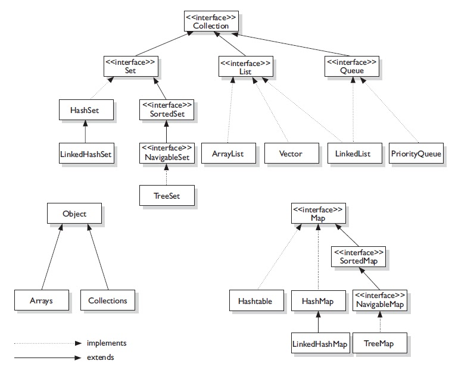

# collections framework
* data structures
* Important interfaces: `List`, `Set`, `Map`
* Other important interfaces: `Iterable`, `Collection`
* many other interfaces, abstract classes, and classes



# [List](https://docs.oracle.com/javase/8/docs/api/java/util/List.html)
* elements
* retain insertion order
* useful methods
  * `add`
  * `remove`
  * `get`
  * `size`
  * `iterator`
  * `listIterator`

# [Set](https://docs.oracle.com/javase/8/docs/api/java/util/Set.html)
* unique elements
  * `equals` method
* does not retain insertion order
* useful methods
  * `add`
  * `remove`
  * `contains`
  * `size`
  * `iterator`

# [Map](https://docs.oracle.com/javase/8/docs/api/java/util/Map.html)
* key value pairs
* useful methods
  * `put`
  * `remove`
  * `get`
  * `keySet`
  * `values`
  * `entrySet`

# Iterator
* interface
  * `hasNext`, `next`, `remove`
* creator of collection is responsible for implementing `Iterator`
  * `next` is guaranteed **O(1)**
* can use if collection **is a** `Iterable`

common looping idiom

```
List<Integer> list = new ArrayList<>();
list.add(10);
list.add(20);
list.add(30);

Iterator<Integer> iterator = list.iterator();

while(iterator.hasNext()) {
  Integer temp = iterator.next();
}
```

# foreach
* also called **enhanced for loop**
* converted to use `Iterator` behind the scenes
* cannot modify collection - `ConcurrentModificationException`

common looping idiom

```
List<Integer> list = new ArrayList<>();
list.add(10);
list.add(20);
list.add(30);

for(Integer temp : list) {

}
```

IQ: difference between `for`, `foreach`, `Iterator`

# Other collections
* `LinkedList`, `Stack`, `Queue`, `Deque`
* `Vector` vs `ArrayList`
* `HashSet` vs `TreeSet`
* `HashMap` vs `TreeMap`


## What is the Collections Framework?
* Collections Framework in Java is a set of classes and interfaces that implement commonly used data structures
* A collection is a single object which acts as a container for other objects

## ```List<E>``` - Interface
    * ordered => preserves the order in which inserted
    * duplicate entries allowed
    * elements accessed by index

### ```ArrayList<E> implements List<E>```
    * resizable array
    * traversal is fast (constant time)
    * insertion/removal is slow (linear time, since there is a risk of having to resize the underlying array)

### ```LinkedList<E> implements List<E>, Queue<E>```
    * implements both List and Queue => has all methods in both interfaces
    * insertion/removal is fast (no risk to resize)
    * traversal is slow for an arbitrary index

### ```Vector<E> implements List<E>```
    * Old school, essentially a thread-safe implementation of an ```ArrayList```

### ```Stack<E> implements List<E>```
    * Old school, should use an ```ArrayDeque``` for the Stack data structure

## ```Set<E>``` - Interface
    * NOT index driven
    * Unique elements allowed only
    * DOES NOT preserve the order in which they were inserted

### ```HashSet<E> implements Set<E>```
    * Backed by a HashMap<K, V>
    * Guarantees no ordering when iterating
    * Allows one null value
    * Insertion/Traversal are fast
    * Tradeoff is that it does not maintain order in which you insert elements

### ```TreeSet<E> implements Set<E>```
    * Backed by a Sorted Tree
    * Main benefit is that they maintain sorted order
    * Tradeoff is that insertion/removal are slow, because the elements must maintain sorted order
    * Cannot contain any null values, since null cannot be compared to any object

## ```Queue<E>``` - Interface
    * Used when elements should be added and removed in a specific order
    * Unless specified, elements are ordered FIFO

### ```ArrayDeque<E> implements Queue<E>```
    * Pronounced as 'deck'
    * Implementation of a pure double-ended queue
    * Stores elements in a resizable array
    * can be implemented as either a Queue or a Stack
    * If Queue, we use offer/peek/poll
    * If Stack, we use push/poll/peek
    

### ```ArrayDeque<E>``` Methods
| Operation | Throws Exception | Returns null |
| --------- | ---------------- | ------------ |
| Insert    | ```boolean add(E e)```|```boolean offer(E e)```|
| Remove    | ```E remove()``` | ```E poll()``` |
| Examine   | ```E element()```| ```E peek()```|
```void push(E e)``` is for a Stack (LIFO), which adds elements to the front of the queue

## ```Map<K, V>``` Interface
    * Used to identify a value by a key, each element in a map is a Key-Value pair
    * NOTE: Map does not implement the Collection interface, however it is considered to be part of the Collections framework

### ```HashMap<K,V> implements Map<K,V>```
    * Stores elements in key-value pairs
    * Insertion/Retrieval of elemeny by key is fast
    * Tradeoff is that it does not maintain the order of insertion
    * Permits one null key and null values

### ```TreeMap<K,V> implements Map<K,V>```
    * Keys are stored in a Sorted Tree structure
    * Main benefit is that keys are always in a sorted order
    * Insertion/Retrieval are slow
    * Cannot contain null keys as null cannot be compared for sorting

### ```Hashtable<K,V> implements Map<K,V>```
    * Old school, thread-safe implementation of a HashMap
    * Does not allow null keys or null values


