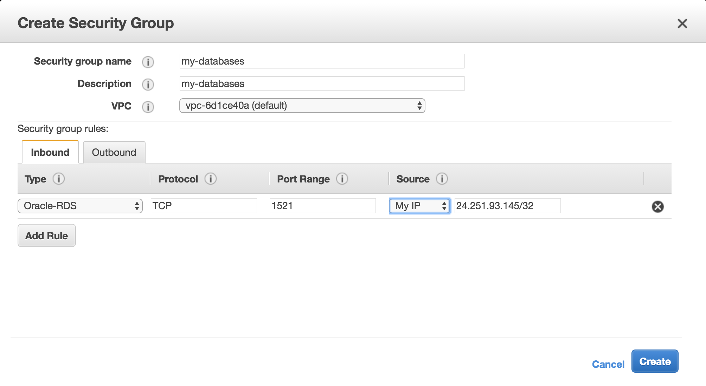
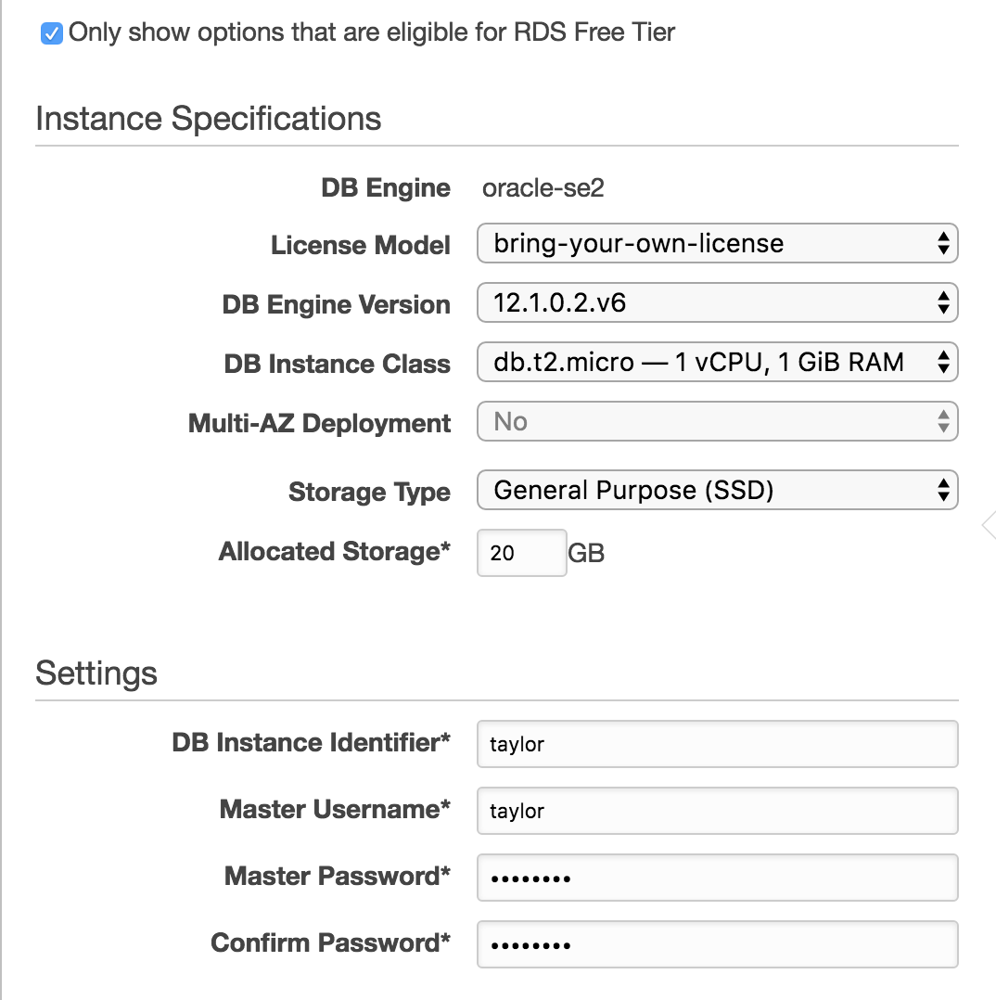
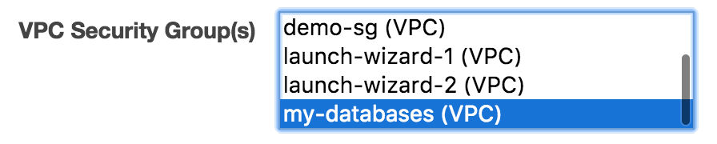
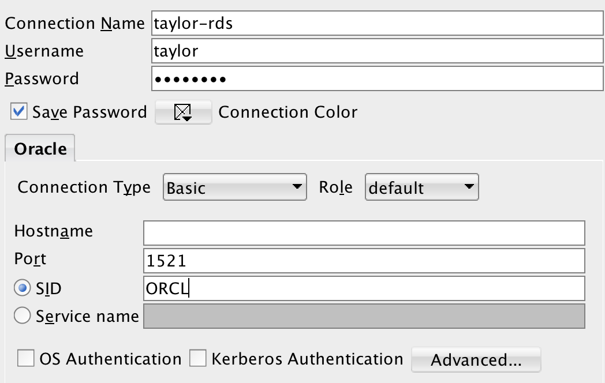

# RDS
* Relational Database Service
  * it is a managed database service provided by AWS
* **Warning:** constantly check the *Billing Dashboard*

# Create Security Group
* a security group is like a firewall

###### 1) Go to *Services* then *EC2*

###### 2) On the left, click *Security Groups*

###### 3) Select *Create Security Group*

###### 4) Configure security group
* You may want to add another rule for your home wifi

###### 5) Select *Create*

# Create RDS instance

###### 1) Go to *Services* then *RDS*

###### 2) Go to *Instances* then *Launch Instance*

###### 3) Select *Free tier eligible only*

###### 4) Select *Oracle* then *Oracle SE Two*

###### 5) IMPORTANT: If asked, select *Dev/Test*

###### 6) Configure RDS

###### 7) Select security group

###### 8) Launch
* It will take 5-10 minutes before the RDS instance is ready

# Connect with SQL Developer
* Ensure you have [SQL Developer](sql-developer.md) installed

###### 1) In SQL Developer, click the green plus sign
* This will create a new connection

###### 2) Configure connection
* You need to get the **Endpoint** for your RDS instance and enter that in the **Hostname** below

###### 3) Click Test
* Make sure it says `Status: Success` in the bottom left

###### 4) Click Save
