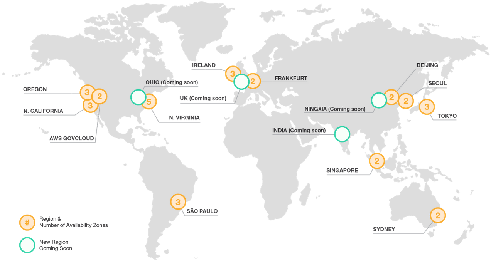
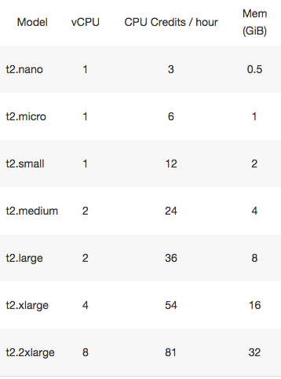
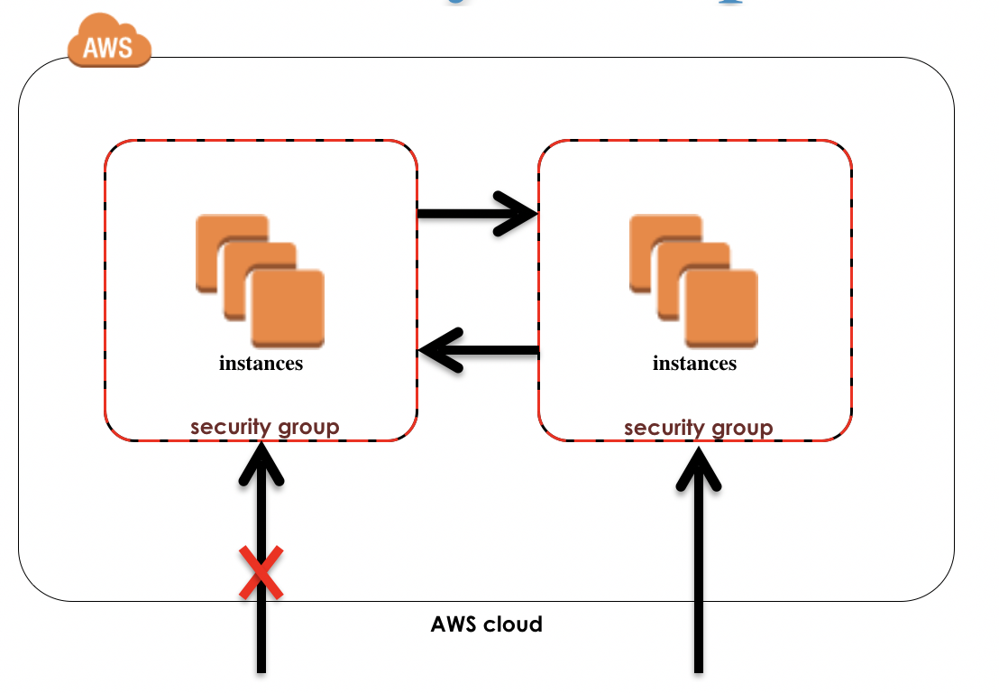

# Amazon Web Services (AWS)
* **Cloud provider**
* Lot’s of servers
* Provide many **useful tools** (web services) that can be accessed remotely
* Over 1 million customers
* Focus on **elasticity** (up and down) and **reliability**

# AWS is worldwide

### Region
* Geographical area
* Each Region consists of 2 or more AZ
* *Count:* 14

### Avalability Zones
* Data center
* *Count:* 38

### Edge Locations
* CDN End Points for CloudFront
* *Count:* 65

# Service overview
* Compute
* Storage
* Database
* Networking

# Amazon EC2
* Stands for *Elastic Compute Cloud*
* Useful tool (Web Service)
* Easily and quickly get server instances
* Scale up and down
* Only pay for what you use
* Important topics
  * AMI
  * Instance types
  * Instance sizes
  * Security groups
  * Pricing

# AMI
* Amazon Machine Image
* Snapshot of a computer
* Includes OS and other code
* Image of my computer
  * OSX
  * Java 1.8
  * Maven 3.3.9
  * Chrome
  * iTunes

# EC2 Instance types

| Type |      Purpose      |
|:----:|:-----------------:|
|  t2  |      General      |
|  c4  | Compute Optimized |
|  r4  |  Memory Optimized |

# EC2 Instance sizes

# Security groups
* Virtual firewall
* Controls traffic for one or more instances

# Pricing
* AMI
* Instance type
* Instance size
* Region
* **Pay per hour**
* Data transfer *(per GB)*
