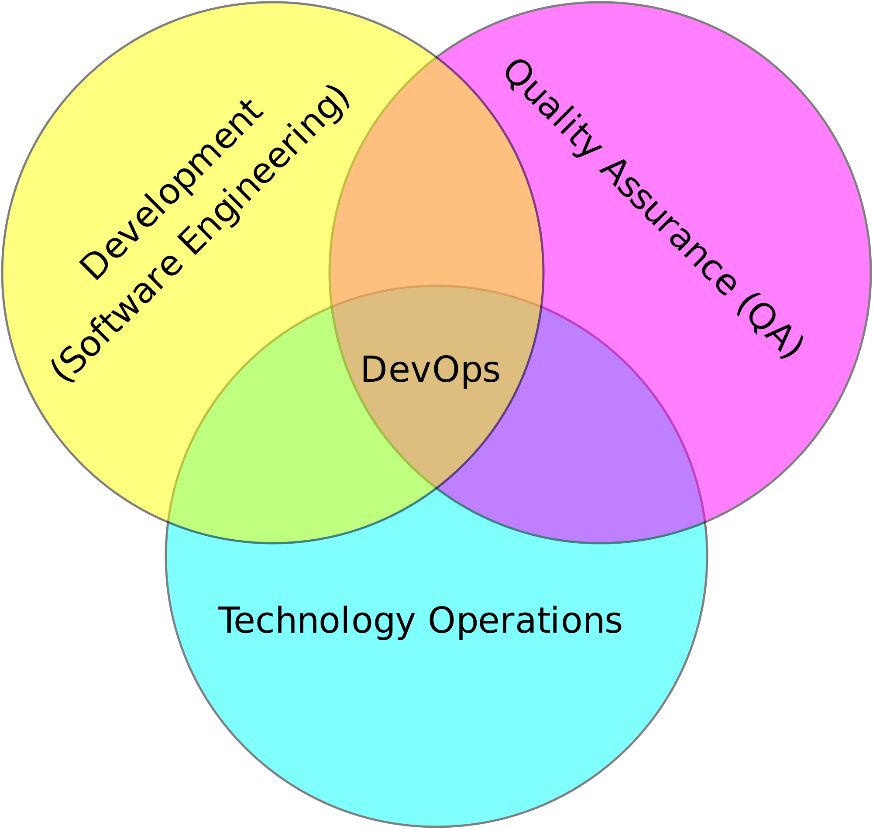
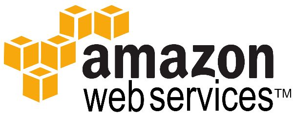

# What is DevOps?
* Automated Testing
* Continuous Integration
* Continuous Delivery
* Automated Infrastructure
* Automated… everything

# What DevOps is NOT
* Not simply developers with operations skills (or vice versa)
* Not a product, software, or hardware technology—it is a culture
* Not an unattainable goal
  * Used by Netflix, Walmart, Facebook, General Electric, and more
* DevOps is a mindset! A culture change!

# Continuous Integration (CI)
* Development practice
* Developers **integrate code into a shared repository** several times a day
* Each push triggers an **automated build**
* Allows teams to detect problems early

# Continuous Delivery (CD)
* Take CI one step further
* Development practice
* Deliver every change to a production-like environment
* Ensure business applications and services function as expected through rigorous automated testing
* Complete automation gives us confidence the application can be deployed to production with a push of a button when the business is ready

# Continuous Deployment (CD)
* Take Continuous Delivery one step further
* Pipeline deploys to production

# Tools

### Jenkins

* Open source automation server
* Written in Java
* Sometimes called a build server or a CI/CD server

### AWS

* Cloud provider
