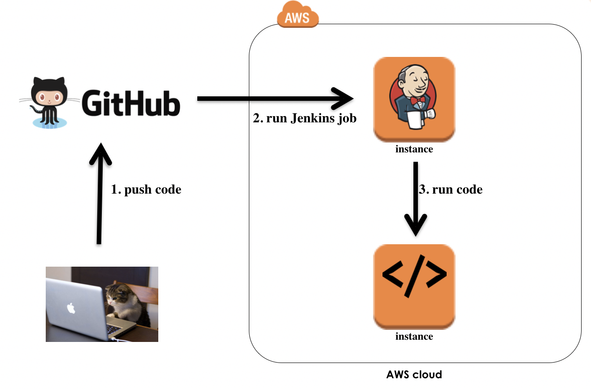
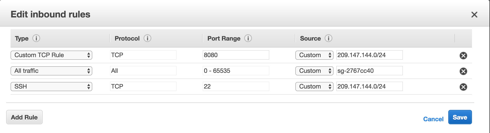
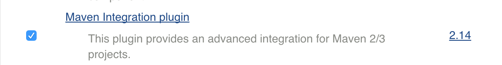
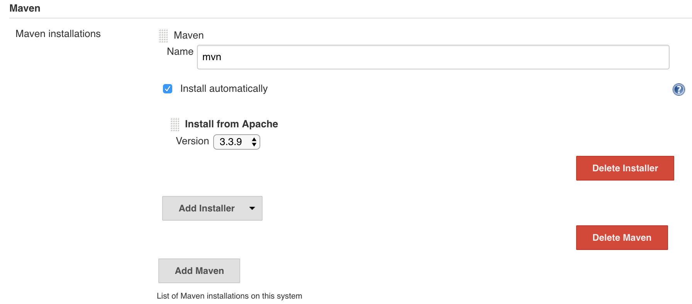
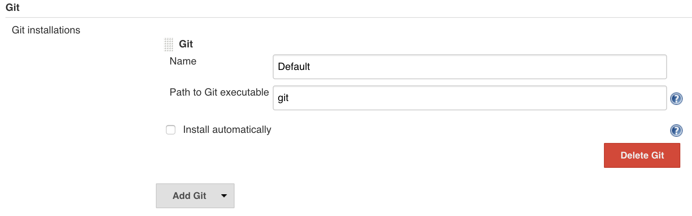
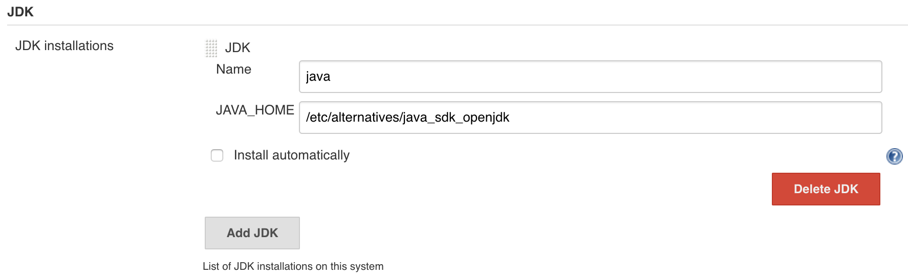
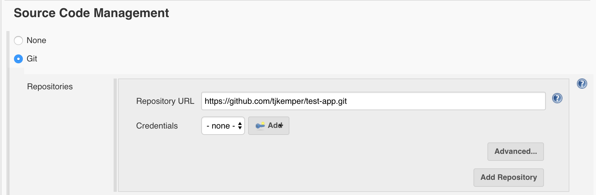
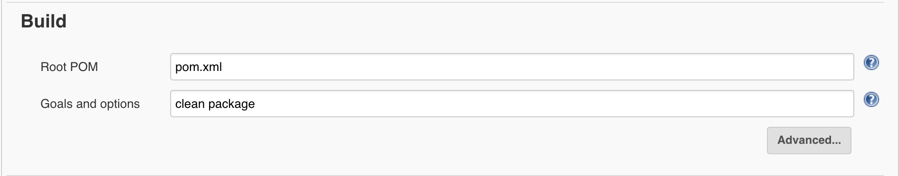

# Pipeline walkthrough
Create a devops pipeline



# Create security group



# Spin up instance for Jenkins
* **Type:** t2.micro
* **AMI:** Amazon Linux
* **Security Group:** DMZ
* **Key Pair:** MyKeyPair

boot script

```
#!/bin/bash

sudo yum install -y java-1.8.0-openjdk-devel
sudo yum remove -y java-1.7.0-openjdk

sudo wget -O /etc/yum.repos.d/jenkins.repo https://pkg.jenkins.io/redhat/jenkins.repo
sudo rpm --import https://pkg.jenkins.io/redhat/jenkins.io.key
sudo yum install -y jenkins

sudo service jenkins start
sudo chkconfig jenkins on

sudo yum install -y git-all

```

check if Jenkins is running on port `8080`

# SSH
* [SSH into instance](http://docs.aws.amazon.com/AWSEC2/latest/UserGuide/AccessingInstancesLinux.html)

ssh into instance
* replace `0.0.0.0` with your Public IP

```
ssh ec2-user@0.0.0.0 -i MyKeyPair.pem
```

make sure java, mvn, and git are installed

```
java -version
git --version
```

print out initial password for jenkins

```
sudo cat /var/lib/jenkins/secrets/initialAdminPassword
```

# Jenkins - Global Tool Configuration

### Maven
* Install **Maven Integration plugin**



* Install automatically from Apache



### Git
* **Path to Git executable:** git




### Java
* **JAVA_HOME:** /etc/alternatives/java_sdk_openjdk



# Create Jenkins job
* **name:** test
* **type:** Maven project

git repo



build step



Run build and see if it works

### Interesting
jenkins home directory

```
cd /var/lib/jenkins/
```


# Spin up instance for Production
* **Type:** t2.micro
* **AMI:** Amazon Linux
* **Security Group:** DMZ
* **Key Pair:** MyKeyPair

boot script

```
#!/bin/bash

sudo yum install -y java-1.8.0
sudo yum remove -y java-1.7.0-openjdk

sudo yum install -y tomcat8
sudo yum install -y tomcat8-webapps tomcat8-docs-webapp tomcat8-admin-webapps

sudo echo "<tomcat-users xmlns=\"http://tomcat.apache.org/xml\" xmlns:xsi=\"http://www.w3.org/2001/XMLSchema-instance\" xsi:schemaLocation=\"http://tomcat.apache.org/xml tomcat-users.xsd\" version=\"1.0\"><role rolename=\"manager\"/><role rolename=\"manager-script\"/><role rolename=\"manager-gui\"/><role rolename=\"admin-script\"/><user name=\"admin\" password=\"adminadmin\" roles=\"manager,manager-gui,manager-script,admin-script\" /></tomcat-users>" > /usr/share/tomcat8/conf/tomcat-users.xml

sudo service tomcat8 start
sudo chkconfig tomcat8 on
```

### Login to Tomcat manager to make sure it's working
* **username:** admin
* **password:** adminadmin

# Edit Jenkins job to deploy to production server

```
clean package -Dmaven.tomcat.url=http://ec2-54-153-47-243.us-west-1.compute.amazonaws.com:8080/manager/text -Dtomcat.username=admin -Dtomcat.password=adminadmin -Dmaven.tomcat.path=/dog tomcat7:redeploy
```

# Terminate EC2 Instances

# Note
* If you need the `ojdbc7.jar`, remember that it does not exist on the Jenkins instance

need to add a pre step

```
mvn install:install-file -Dfile=jars/ojdbc7.jar -DgroupId=com.oracle \
-DartifactId=ojdbc7 -Dversion=7 -Dpackaging=jar
```
